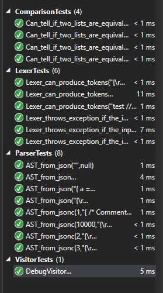

# JSONC

Exercise July 12, 2016

A solution to parse JSON with comments (JSONC).


## Exercise objectives

Parse a subset of JSON (objects, arrays, strings and integers) with the addition of single-line and multi-line comments.

For example:

```
{
    //Comment 1
    a = 1,
    b = [1, 2, 3], //Comment 2
    c = {
            /* Comment 3 on
                several lines */
            d = 1,
            e = "Hello World"
            // Comment 4
        }
}
```

## The lexer

It produces tokens from an input string. Tokens are generic and have a type and a value.

It handles format errors the same way as *int.Parse(...)* does: if a character is not recognized, an **UnknownTokenException** is thrown.

## Parsing

The goal it to produce an AST that represents the structure of the JSONC, where comments become meta-data to a node of the tree according to the following rules:

- becomes meta-data for the following element
- if there is no following element, becomes meta-data for the containing element

Example:

```
{
    // description for the following line
    a = 1,
    b = [1, 2, 3], // description for the following line
    c = {
            /* Long description
                for the following line */
            d = 1,
            e = 2
            // comment for the block
        }
}
```

## Unit tests

The test cases data are provided by the **TestsData** class.

They pass:



## Misc

The AST produced by the parser can easily be rendered as JSON because the comments are not stored on specific nodes but as meta-data of the node representing the element they are related to.

The JSON Visitor can just print the content of the nodes. Another visitor willing to take into account the comments will just have to access the *Comments* properties of the node.